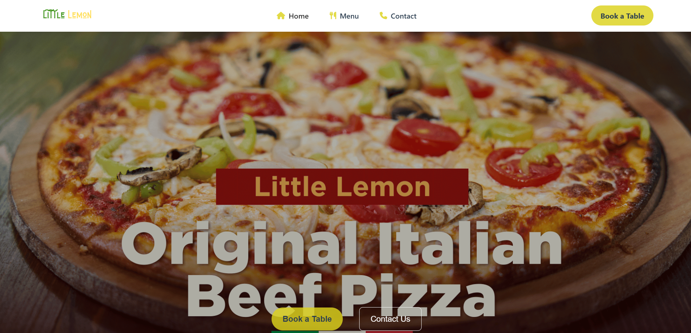
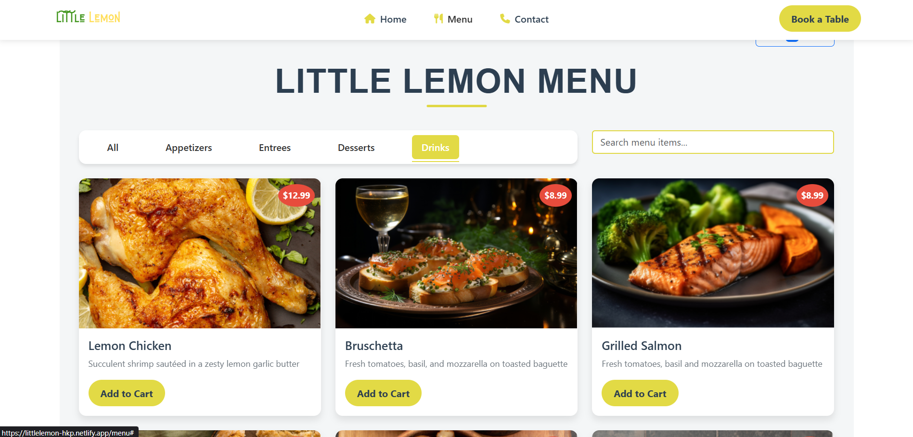
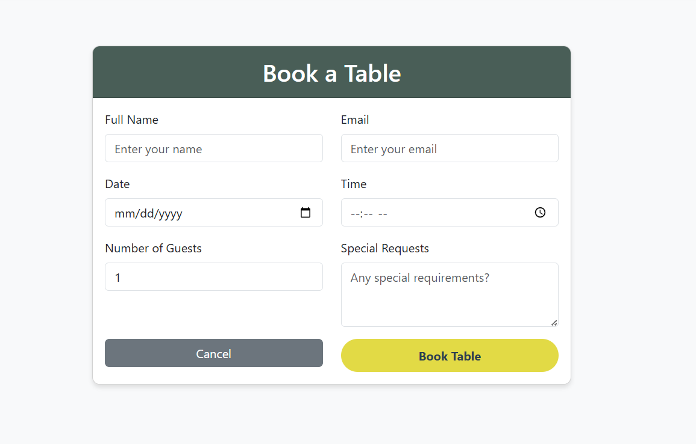
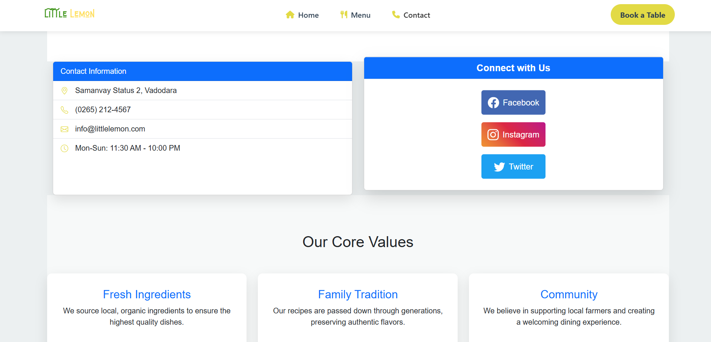
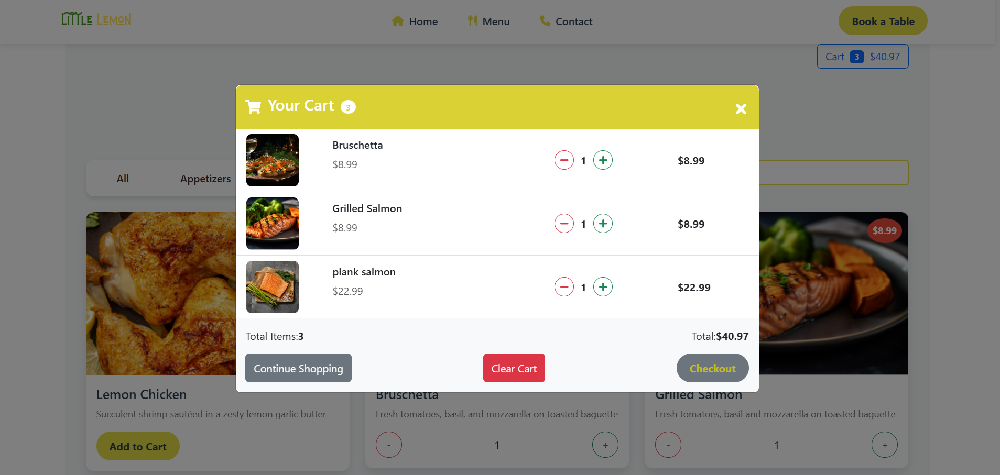

# 🍋 Little Lemon Restaurant

<div align="center">
  
  
  
  
  
  
  
</div>

## 🌟 **About Little Lemon**

Little Lemon is a modern, responsive restaurant website built with React and Bootstrap. This frontend application showcases a Mediterranean restaurant's menu, atmosphere, and booking system with a clean, user-friendly interface.

**🔗 Live Demo:** [Little Lemon Restaurant](https://littlelemon-hkp.netlify.app/)

---

## ✨ **Features**

<div align="center">
  
</div>

### 🍽️ **Restaurant Showcase**
- Beautiful hero section with restaurant branding
- About us section highlighting restaurant story
- Mobile-first responsive layout
- Bootstrap grid system
- Touch-friendly navigation
- Optimized for all screen sizes

### 🍕 **Menu Display**
<div align="center">
  
</div>

- Interactive menu categories
- High-quality food images
- Detailed dish descriptions
- Price display with currency formatting

### 📅 **Table Reservation**
<div align="center">
  
</div>

- Easy-to-use booking form
- Date and time selection
- Party size options
- Contact information collection

---

## 🛠️ **Tech Stack**

| Technology | Purpose | Version |
|------------|---------|---------|
| **React** | Frontend Framework | ^18.0.0 |
| **Vite** | Build Tool | ^5.0.0 |
| **React Bootstrap** | UI Components | ^2.8.0 |
| **Bootstrap** | CSS Framework | ^5.3.0 |
| **CSS3** | Custom Styling | - |
| **JavaScript ES6+** | Programming Language | - |

---

## 🚀 **Getting Started**

### **Prerequisites**
- Node.js (v16 or higher)
- npm or yarn
- Git

### **Installation Steps**

1. **Clone the repository**
   ```bash
   git clone https://github.com/Hetav2211/Little_Lemon.git
   cd Little_Lemon
   ```

2. **Install dependencies**
   ```bash
   npm install
   ```

3. **Start development server**
   ```bash
   npm run dev
   ```

4. **Open your browser**
   ```
   http://localhost:5173
   ```

### **Build for Production**
```bash
npm run build
```

---

## 📱 **Screenshots**

### **About Section**
<div align="center">
  
  <p><em>Restaurant story and chef information</em></p>
</div>

### **Cart Section**
<div align="center">
  
  <p><em>Buying Food online</em></p>
</div>

---


## 🎨 **Design Features**

### **Color Palette**
```css
:root {
  --primary-yellow: #F4CE14;
  --primary-green: #495E57;
  --secondary-peach: #EE9972;
  --secondary-light: #FBDABB;
  --text-dark: #333333;
  --text-light: #FFFFFF;
}
```

### **Typography**
- **Headers:** Markazi Text
- **Body:** Karla
- **Accent:** Dancing Script

### **Key Components**
- ✅ Responsive Navigation Bar
- ✅ Hero Section with CTA
- ✅ About Us Section
- ✅ Featured Menu Items
- ✅ Customer Testimonials
- ✅ Reservation Form
- ✅ Footer with Contact Info

---

## 📊 **Performance**

- ⚡ **Fast Loading** - Vite build optimization
- 📱 **Mobile Optimized** - Bootstrap responsive grid
- 🎨 **Clean Code** - Component-based architecture
- ♿ **Accessible** - Semantic HTML and ARIA labels

---

## 🔄 **Available Scripts**

| Command | Description |
|---------|-------------|
| `npm run dev` | Start development server |
| `npm run build` | Build for production |
| `npm run preview` | Preview production build |
| `npm run lint` | Run ESLint |

---

## 🚀 **Deployment**


### **Netlify**
```bash
npm run build
# Drag and drop dist/ folder to Netlify
```

---

<div align="center">
  <p>🍋 Built with passion by <a href="https://github.com/Hetav2211">Hetav</a> | Made with ❤️ and React</p>
  
  
</div>
